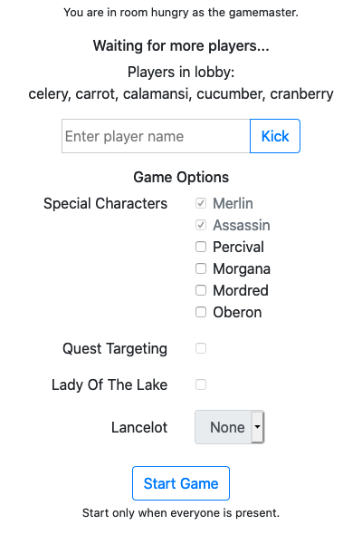
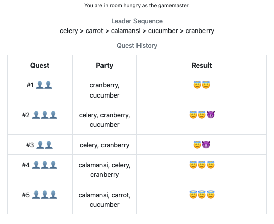
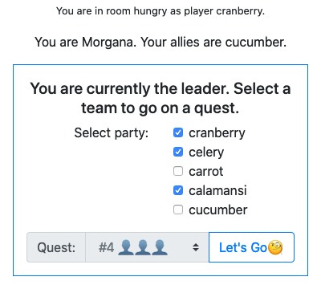
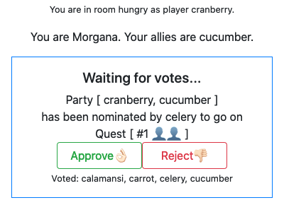
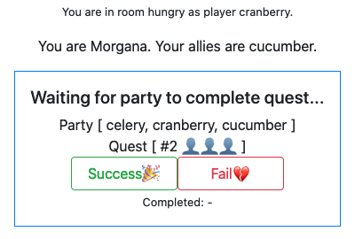

# About

A little demo project using [concur-replica](https://github.com/pkamenarsky/concur-replica). We implement [the Avalon game](https://boardgamegeek.com/boardgame/128882/resistance-avalon) and expose it through an interactive web UI. Currently only the core mechanisms of Avalon are available. Expansions have yet to be implemented.

# Building and running the project
1. Install [cabal](https://www.haskell.org/cabal/) (or use the [haskell docker container](https://hub.docker.com/_/haskell))
2. `cabal update; cabal v2-build`
3. `cabal v2-run` to run the app
4. Navigate to _localhost:8080_ on your browser

# Tech
- [concur](https://github.com/ajnsit/concur): Makes handling events easy since our UI has to concurrently await user input and render server updates.
- [replica](https://github.com/pkamenarsky/replica): Allows real time updates pushed by the server to the client. Also enables direct integration between UI and core logic code, without designing intermediate APIs.
- [stm](https://wiki.haskell.org/Software_transactional_memory): Great for collaborative apps. Helps manage the game state shared across multiple clients.

# Playing the game
Enter a room as either `<player name>` or `gamemaster`. The gamemaster interface will show a settings panel prior to game start and the board state when in game. This gamemaster interface is intended to be streamed over video to the other players. (After all, we're going to play this over video calls because what's the point if we don't see the faces of the liars, right?)

# Screenshots

